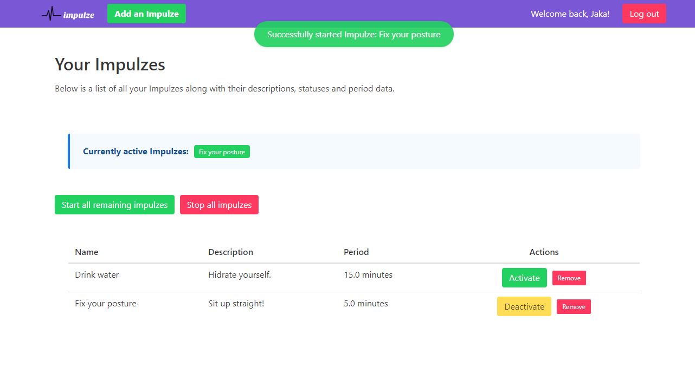
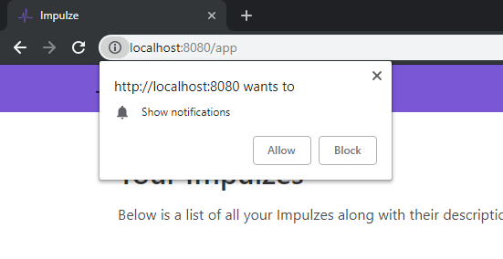

# Impulze  

An impulsive reminder app based on recurring things that you need to be reminded about every so often.

## What is the point?

Ordinary reminder applications aren't really targeted at recurrent reminders happening every so often in a day, such as reminding yourself to drink water
or fixing your posture. Therefore, the minimum period for repeating a reminder is usually 1 day.

This is where Impulze comes to the rescue. You can create Impulzes which remind you about anything even once every minute.

You can see all your created Impulzes on the home screen of the app, from which you can also add new ones.

The reminders get sent as browser notifications to your operating system, so you will be prompted to enable notifications for this site in order to be reminded.

By using browser notifications we can achieve a reminder application, that you don't need to download, but keep in mind that some browsers (mostly older ones) do not support this feature.

## Setup instructions

When getting started, you will need to install all of this project's dependencies by running `npm install` and `npm run client-install`. That will ensure that you have the correct dependencies installed in your environment for both the server and client applications.

For local development, you will also need to create and initialize a MongoDB database and set some environment variables. You can also use a service like [mlab](https://mlab.com/) or a MongoDB Docker Image, to which you will connect by setting the following variables:

- `MONGODB_URI` environment variable should contain the URI to the database
- `MONGODB_USERNAME` and `MONGODB_PASSWORD` should contain the username and password of the user that has R/W access to the database.

You also need to add a `JWT_SECRET` to your environment, as this project uses a JSON web token architecture for authenticating users.

Then, simply run `npm run dev` in the root of the project.

To run tests for the server, run `npm run test:server` and to run test for the client application, run `npm run test:client`.

You can also just run `npm test` which will run both test suites (this command also gets executed at every push in the Travis CI service to ensure all the test are passing after making changes in the repository).

## Team

Maintainer: Jaka Stavanja [@jstavanja](https://github.com/jstavanja)